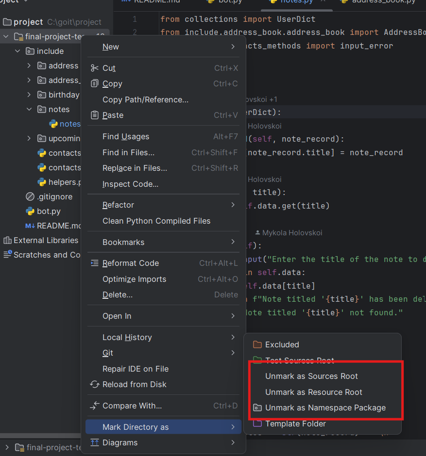

# Final project of the Python course by Chernihivske team (team 12)

## This repository contains a **Python-based assistant** bot that performs the following functions:

1. **Contact Management**: Allows you to store contacts with names, addresses, phone numbers, emails, and birthdays in a contact book.
2. **Birthday Tracking**: Displays a list of contacts whose birthdays are within a specified number of days from the current date.
3. **Data Validation**: Verifies the correctness of phone numbers and emails when creating or editing a contact, notifying the user in case of incorrect input.
4. **Contact Search**: Enables searching through the contacts in the contact book.
5. **Editing and Deleting Contacts**: Provides the ability to edit and delete entries in the contact book.
6. **Note Management**: Allows you to store, edit, and delete text-based notes.
7. **Note Search**: Offers functionality to search through saved notes. 

This bot is designed for efficient management of contacts and notes, focusing on user convenience and ensuring data accuracy.

## Project requirements

### GIT
```https://git-scm.com/```

### Python
```https://www.python.org/```

## Project setup guide

#### SSH
``git clone git@github.com:DmytroShirobokov92/final-project-team-12.git``

#### HTTPS
``git clone https://github.com/DmytroShirobokov92/final-project-team-12.git``

#### IMPORTANT Setup path for project
`` EXAMPLE: how to set correct path for project, mark main folder as Source Root, Resourse Root and Namespace package using PyCharm``
``git clone https://github.com/DmytroShirobokov92/final-project-team-12.git``

## Bot commands description

#### Start bot
```hello```

#### Add new contact with phone
```add-contact {user_name} {user_phone}```

#### Add contact email 
```add-email {user_email}```

#### Add contact address 
```add-email {city} {street} {house num} {flat num}```

#### Add contact birthday
```add-birthday {user_name} {birthday_date}```

#### Show contact phone
```phone {user_name}```

#### Find users by email
```"show-phone", "find-phone" {part or full value to search}```

#### Find users by name
```"show-name", "find-name" {part or full value to search}```

#### Find users by address
```"show-address", "find-address" {part or full value to search}```

#### Find users by email
```"show-email", "find-email" {part or full value to search}```

#### Find users by any valie: name, email, address, email
```"show", "find" {part or full value to search}```

#### Show all users list
```all | contacts-list```

#### Show user birthday date
```show-birthday {user_name}```

#### Show upcoming users birthdays related days ahead 
```birthdays```

``F.E. if today 13.08 -- (birthdays 5) return users birthdays list 13.08-18.08 dates in format '13.08': 'foo, bar', '14.08': 'user_3'``

#### Modify or create new note
```add-note | modify-note```

#### Shows list of all notes
```all-notes```

#### Search note by anu word on title or body
```search-note```

#### Remove note by note title
```remove-note```

#### Exit
```close | exit```

#### The bot automatically saves data on your system
